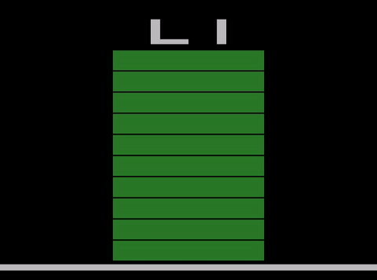

# Snake Atari 2600
An implementation of snake for the Atari 2600.

## Table of Contents
- [Implementation Details](#implementation-details)
- [Disclaimers](#disclaimers)
- [Play Online](#play-online)
- [Instructions](#instructions)
- [Usage](#usage)
    - [Play Game on an Emulator or Console](#play-game-on-an-emulator-or-console)
    - [Compile and Use Binaries](#compile-and-use-binaries)
- [Challenges](#challenges)
    - [Racing the Beam](#racing-the-beam)
    - [Placing the Apple in the Playfield](#placing-the-apple-in-the-playfield)
    - [Fitting Into 128 Bytes of RAM](#fitting-into-128-bytes-of-ram)

## Implementation Details
- Written in 6502 Assmebly Language
- Uses smallest game cartridge configuration
    - 2k bytes of ROM
    - 128 bytes of RAM

## Disclaimers
This is my first Assembly Language project, not to mention my first Atari 2600 game at this level, so my implementation for some things may not be perfectly ideal. *Learn more about these challenges in [Challenges](#challenges)*

If you're interested in looking further into 6502 Assmebly Langauge or Atari 2600 development, I have a [repository](https://github.com/careyes17/6502-practice) that contains several useful resources.

## Play Online
Try out Snake in your browser at [Javatari](https://javatari.org/?ROM=https://github.com/careyes17/snake-atari-2600/raw/master/snake.bin)

## Instructions

This game is intended to be used with a `joystick controller`, where the fire button is not used.

You can select one of three game modes (normal, slow, and fast) by pulling the `select` lever on the console.

To start/restart the game, you can pull the `reset` lever on the console.

## Usage

### Play Game on an Emulator or Console

1. Download the `snake.bin` file from the top level directory.
2. Use this binary file in your emulator of choice or burn it/put it on a cartridge and use it on an Atari 2600.

### Compile and Use Binaries

1. Install the [DASM](https://dasm-assembler.github.io/) assembler in order to compile the `.asm` source files
2. Copy the `vcs.h` and `macro.h` files that come with DASM for the Atari 2600 into the `lib` directory
3. Enter one of the project directories
4. Perform the command:

    `$ sh compile.sh`

5. Enter the bin folder that was created
6. Use the `.bin` file in your Atari 2600 emulator of choice

## Challenges

### Racing the Beam
Writing anything in assembly language can be a challenge, however it allows you to leverage every cycle your CPU has to offer in order to perform a task. Developing for the Atari 2600 heavily depends on cycle counting.

The Atari 2600 does *not* have VRAM (Video Ram), and instead elects to use a chip called the TIA (Television Interface Adapter) which drives all of the video processing of the console. Because RAM was incredibly expensive in 1977, using the TIA surely saved Atari a lot of money in manufacturing which contributed to the console selling millions of units. But this came at a huge hit to the DX (Developer Experience).

The TIA chip is used directly by the CPU to generate graphics on the TV "*on the fly*". This means that the CPU must communicate in a very small (72 cycle) time window with the TIA chip on any given scanline to generate compelling graphics.

Almost everything on the Atari 2600 must be programmed by hand, this includes manipulating the electron beam on the TV that draws every frame of video, one pixel at a time, for every scanline.

This may not seem that bad at first, but we must understand that a simple "do nothing" (NOP) operation on the CPU costs 2 clock cycles. This means that any "on the fly" playfield manipulation MUST be compact enough to fit within 72 clock cycles.

If you go beyond the 72 clock cycle limit, your image starts distorting and producing unintended results.

*Here is where the contrived optimizations come in.*

For this snake implementation, I used the playfield in order to display the snake game. The Atari 2600, for reasons I won't go into here, offers a playfield that encompasses the "left half" of the screen which can be turned on and off via bit manipulation. This playfield can be mirrored in order to save clock cycles, making a symmetrical playfield.

This symmetrical playfield optimization was not an option for this game. The snake must be able to  exist on both the left and right sides of the screen, where its body can be in an asymmetrical state. This means that the playfield MUST be changed on the fly, mid electron beam, in order to change the playfield once it gets to the right side of the screen.

The main drawing routine that fits into the 72 clock cycles in this snake implementation is full of playfield bit manipulation and logical operations in order to accurately display the state of the snake and its body.

This is so time critical in fact, that one misplaced "do nothing" command can completely break the game graphics.

### Placing the Apple in the Playfield

The algorithm associated with placing the apple at a random location in the playfield consumes a total of around 2000 cycles in a worse case scenario.

The Atari 2600 uses syncing signals to communicate when to draw to the screen. In [Racing the Beam](#racing-the-beam), I explained that we have a 72 clock cycle period of time where the screen is being drawn to. After all of the scanlines the user sees are completed processing, the system enters blanking periods, giving us some much-needed breathing room in terms of CPU clock cycles available to perform game logic.

In the vertical blanking period, we have 2812 clock cycles to play with. The overscan period also grants us 2280 more clock cycles.

After having optimized/worked with the TIA to produce video output in a 72 clock cycle window, having 5092 clock cycles for processing game logic feels extremely liberating.

However this may be deceivingly abundant. There are several big O(1) (constant time) subroutines that we need to hit every frame, which eat up some cycles, but what really consumes the majority of our processing bandwidth are looping operations.

Because we have a limited cycle count that we must not go over, some of the algorithms used were not very DRY (Don't Repeat Yourself). But there was a good reason for this.

If you use "fancier" quality of life instructions or instructions that help with code maintainability, there are often very severe cycle count penalties. So having these more costly operations occur in every loop eats into our cycle count *fast*.

Even having simple comparison logic, bit shifting operations, and loading variables/table values for DRYness significantly increases the cycle count of loops in many situations. This makes it unfeasible to implement certain algorithms in the way I would have preferred.

As a result, the apple placement algorithm does have some unfortunately unsightly but "quick" optimizations that reduce its DRYness.

### Fitting Into 128 Bytes of RAM

It's not impossible to conceive of a simple game's logic being able to fit in some 2-4k of ROM in assembly language. In fact, this project (in all of it's not perfectly optimized glory) still fits into 2k of ROM. At no point during the development process did I feel as though I was running out of ROM space.

But RAM on the other hand, this was a constant struggle throughout the entire development process.

The Atari 2600 advertises 128 bytes of RAM, which is not entirely true in its implementation. The stack stores pointers for subroutine calls at the top of the 128 bytes. This means that when architecting your RAM usage, you need to make sure that you know the max depth for subroutine calls that you will allow.

I'm not going to go into detail about how I used single byte RAM locations to store things like "Snake Head Pointer", "Snake Tail Pointer", "Score", etc. as this is not really the main problem I had when implementing snake in 128 bytes of RAM.

*Here's the interesting part*

How did I implement storing the snake's "head history"?

Let me first define what I mean by "head history". I refer to "head history" as a system of storage in which you are able to derive where the tail of the snake is at any given frame of gameplay.

Having such a "head history" system allows us to "delete" the tail from the playfield after the snake head has moved.

Having only 128 bytes of RAM significantly restricts the size of playfield you are able to have.

For example, the playfield size I ended up using for this snake implementation is 10 x 8. Meaning that to represent the whole snake body (potentially), you need 80 spaces in RAM (or 79 depending on your implementation).

With 48 bytes of RAM left at my disposal, this gave me a "comfortable" amount of room to define some quality of life variables. This also had the added benefit of simplifying the playfield rendering process to some degree.

Now, in order to use less RAM for storing the "head history" (meaning you could significantly increase the size of the playfield), you would have to use a more creative solution that I chose not to explore with this project.
